# 🦊 Nightfox Acrylic Theme Gallery

Visual showcases and cross-platform comparisons for all 6 themes across **Windows 11** and **Linux GNOME**.

> **Windows 11**: Demonstrates dynamic Acrylic / frosted glass translucency when window focus toggles (Translucent BG plugin).  
> **Linux GNOME**: Demonstrates native background blur powered by Wayland / X11 compositor (*Blur my Shell* extension).

---

## 📑 Jump to Theme

- [Carbonfox Acrylic (Dark)](#-carbonfox-acrylic)
- [Duskfox Acrylic (Dark)](#-duskfox-acrylic)
- [Nightfox Acrylic (Dark)](#-nightfox-acrylic)
- [Nordfox Acrylic (Dark)](#-nordfox-acrylic)
- [Terafox Acrylic (Dark)](#-terafox-acrylic)
- [Dawnfox Acrylic (Light)](#-dawnfox-acrylic)

---

## 🐺 Carbonfox Acrylic

> **Carbon grays** with vibrant cyan headers, cool blue subheadings, and pink accents.

| Windows 11 (Focus Blur Dynamics) | Linux GNOME (Blur my Shell) |
| :---: | :---: |
|  | 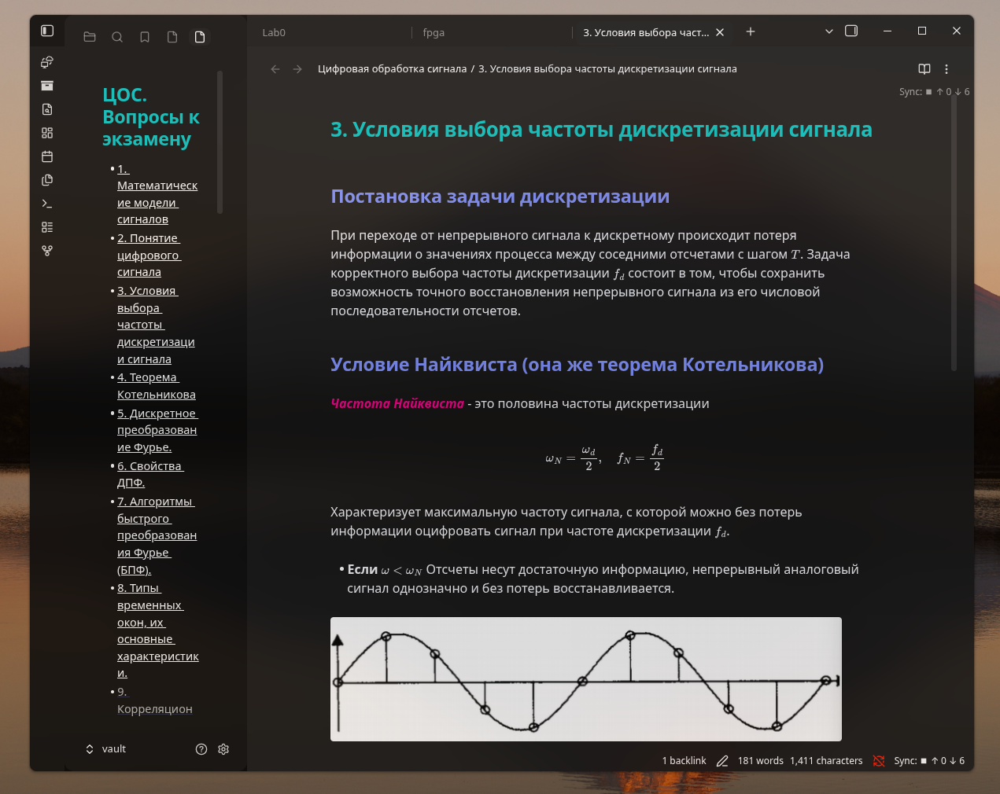 |

[↑ Back to top](#-nightfox-acrylic-theme-gallery)

---

## 🔮 Duskfox Acrylic

> **Deep atmospheric purple dusk** with soft violet titles and warm amber accents.

| Windows 11 (Focus Blur Dynamics) | Linux GNOME (Blur my Shell) |
| :---: | :---: |
| 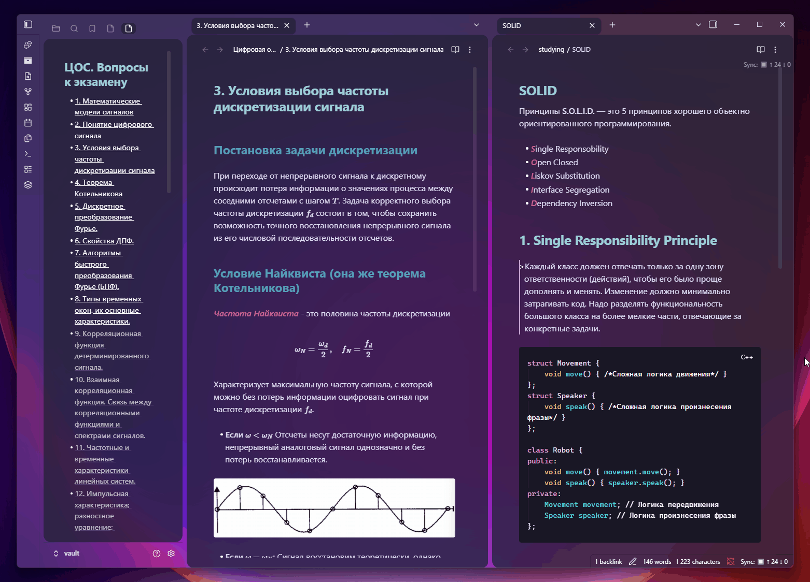 | 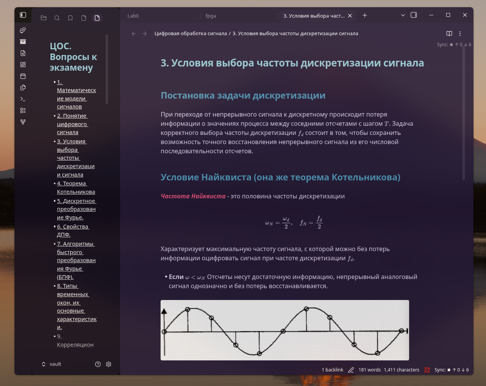 |

[↑ Back to top](#-nightfox-acrylic-theme-gallery)

---

## 🌙 Nightfox Acrylic

> **Signature deep navy blue** with crisp cool whites and teal accents.

| Windows 11 (Focus Blur Dynamics) | Linux GNOME (Blur my Shell) |
| :---: | :---: |
| 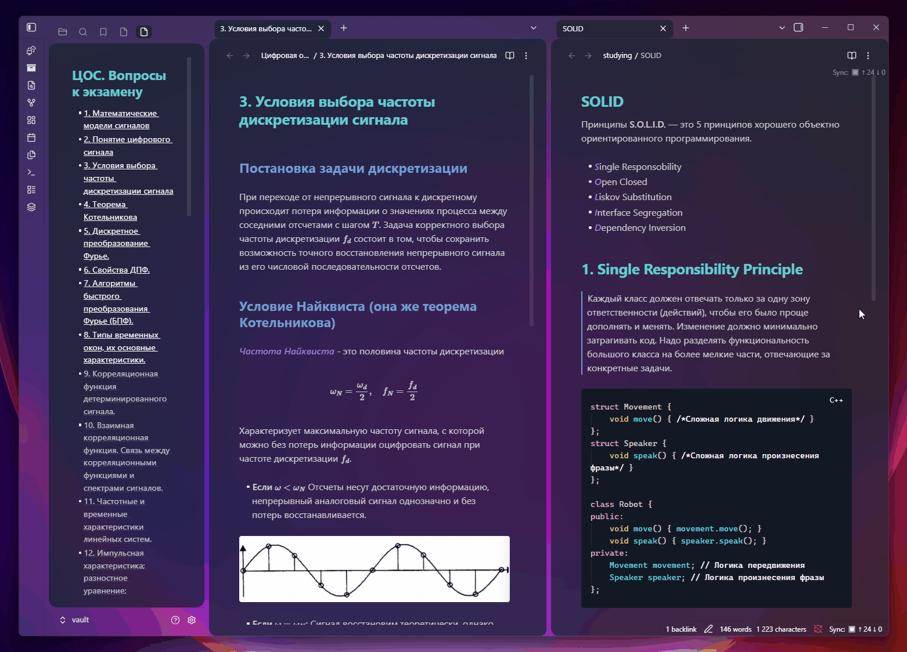 | 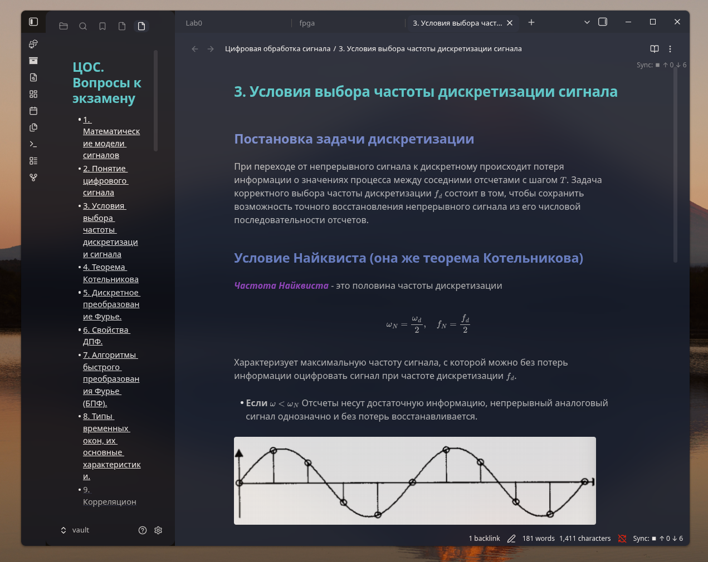 |

[↑ Back to top](#-nightfox-acrylic-theme-gallery)

---

## ❄️ Nordfox Acrylic

> **Cool Arctic blues** and frost tones inspired by the classic Nord palette.

| Windows 11 (Focus Blur Dynamics) | Linux GNOME (Blur my Shell) |
| :---: | :---: |
| 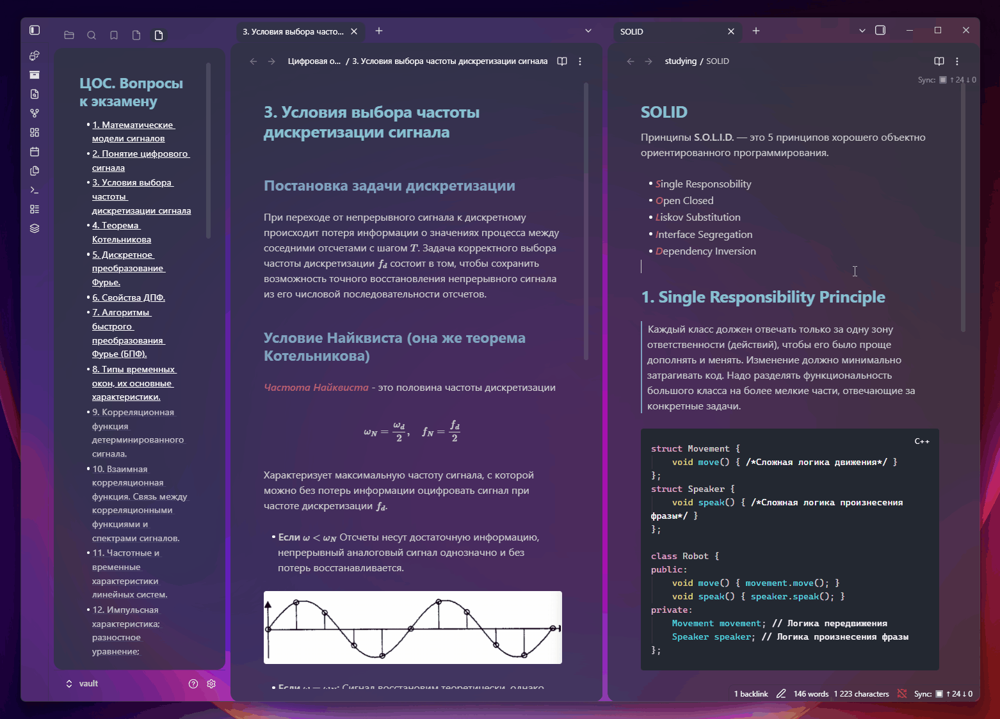 | 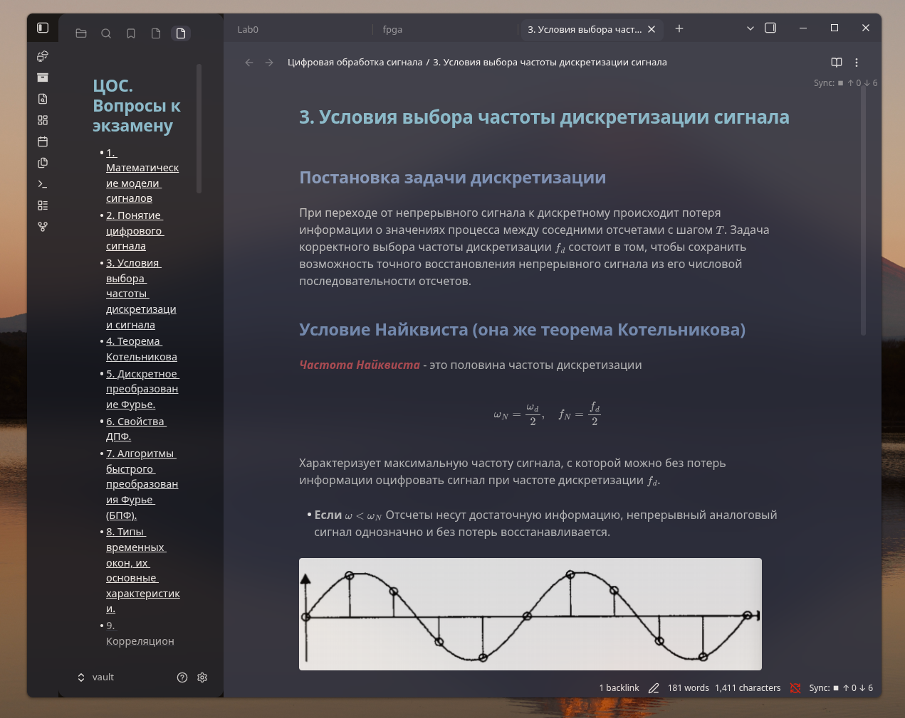 |

[↑ Back to top](#-nightfox-acrylic-theme-gallery)

---

## 🦊 Terafox Acrylic

> **Earthy ochres**, warm browns, and amber tones for a grounded, comfortable reading experience.

| Windows 11 (Focus Blur Dynamics) | Linux GNOME (Blur my Shell) |
| :---: | :---: |
| 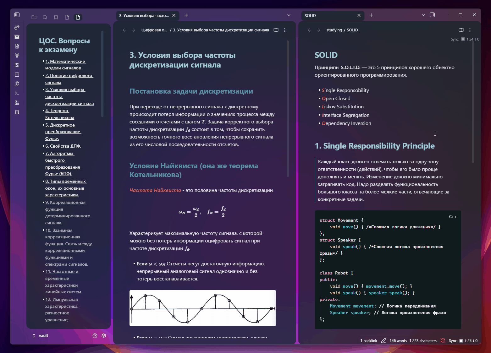 | 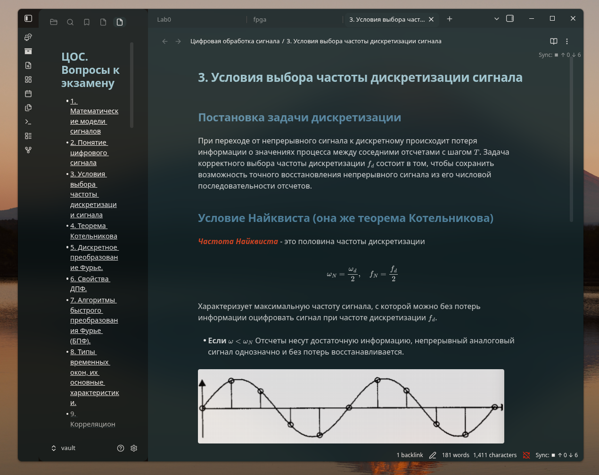 |

[↑ Back to top](#-nightfox-acrylic-theme-gallery)

---

## ☀️ Dawnfox Acrylic

> **Soft daylight palette** with warm muted pastels and enhanced contrast for crisp light-mode readability.

| Windows 11 (Focus Blur Dynamics) | Linux GNOME (Blur my Shell) |
| :---: | :---: |
| 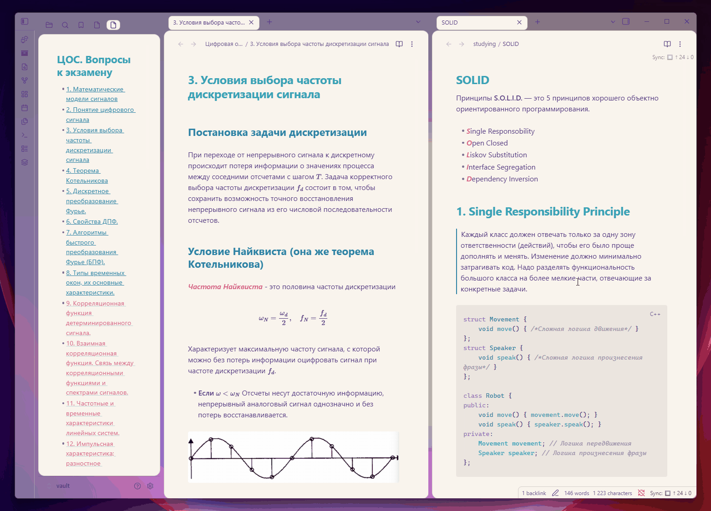 | 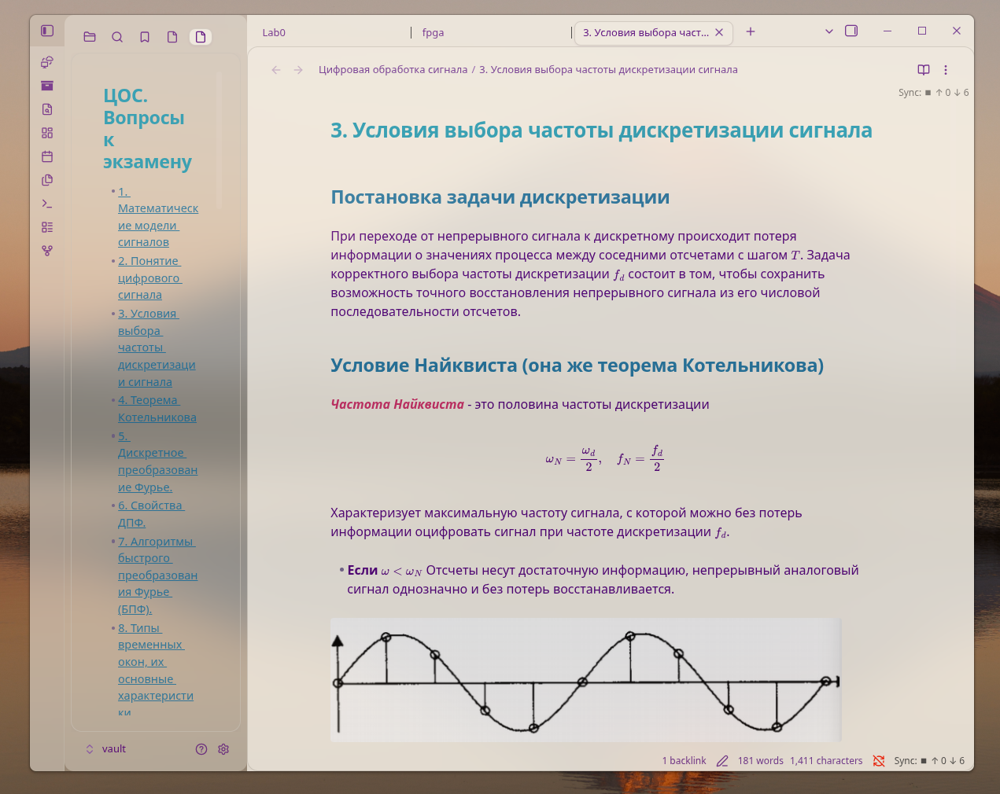 |

[↑ Back to top](#-nightfox-acrylic-theme-gallery)
