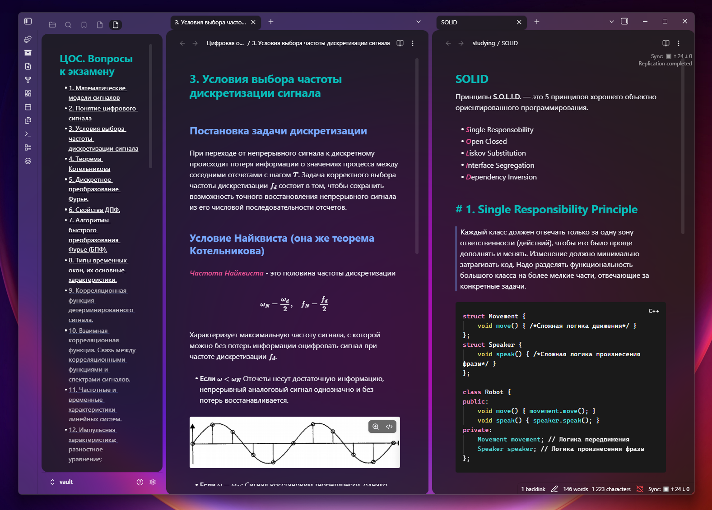

# Nightfox Acrylic Theme Pack for Obsidian

A premium suite of **Acrylic / Frosted Glass** themes for [Obsidian](https://obsidian.md), inspired by the **Zed Editor** and the renowned **Nightfox** palette family created by [EdenEast](https://github.com/EdenEast/nightfox.nvim).

Built on the glass layout foundations of **[Blur Theme](https://github.com/Jawuj/Blur-Theme) by Jawuj**, redesigned and polished for true system translucency, distraction-free note-taking, and cross-platform consistency across **Windows 11** and **Linux (GNOME / KDE / Wayland)**.



> 📸 **Visual Showcase:** Check out the full **[Theme Gallery (GALLERY.md)](GALLERY.md)** for side-by-side previews of all 6 themes across **Windows 11** (dynamic acrylic GIFs) and **Linux GNOME** (Blur my Shell screenshots).

---

## 🎨 Themes in This Pack

| Theme | Description & Palette | Flavor | Showcase |
| :--- | :--- | :--- | :---: |
| **Carbonfox Acrylic** | Carbon grays with vibrant cyan headers, blue subheadings, and pink accents | Dark | [Preview](GALLERY.md#-carbonfox-acrylic) |
| **Duskfox Acrylic** | Deep atmospheric purple dusk with soft violet and amber accents | Dark | [Preview](GALLERY.md#-duskfox-acrylic) |
| **Nightfox Acrylic** | The signature deep navy blue with cool white and teal accents | Dark | [Preview](GALLERY.md#-nightfox-acrylic) |
| **Nordfox Acrylic** | Cool Arctic blues and frost tones inspired by the Nord color scheme | Dark | [Preview](GALLERY.md#-nordfox-acrylic) |
| **Terafox Acrylic** | Earthy ochres, warm browns, and amber tones | Dark | [Preview](GALLERY.md#-terafox-acrylic) |
| **Dawnfox Acrylic** | Soft, low-contrast daylight palette with warm muted pastels | Light | [Preview](GALLERY.md#-dawnfox-acrylic) |

---

## 🎨 Inspiration & Heritage

- **Color Palettes**: Derived from [EdenEast/nightfox.nvim](https://github.com/EdenEast/nightfox.nvim) and the flavor implementations in [Zed Editor](https://zed.dev).
- **Base Layout**: Built upon the foundational CSS architecture of **[Blur Theme](https://github.com/Jawuj/Blur-Theme) by Jawuj**, re-engineered for proper window compositing, clean island geometry, and opaque code blocks.

---

## 🚀 Installation

1. Open your Obsidian vault folder.
2. Navigate to `.obsidian/themes/` *(create the `themes` directory if it does not exist)*.
3. Copy the desired theme folder (e.g. `Carbonfox Acrylic`) into `.obsidian/themes/`:
   ```text
   YourVault/
   └── .obsidian/
       └── themes/
           ├── Carbonfox Acrylic/
           │   ├── manifest.json
           │   └── theme.css
           ├── Duskfox Acrylic/
           ├── Nightfox Acrylic/
           ├── Nordfox Acrylic/
           ├── Terafox Acrylic/
           └── Dawnfox Acrylic/
   ```
4. In Obsidian, open **Settings → Appearance → Themes** and select your preferred Nightfox Acrylic theme.

---

## 🪟 Blur Setup Guide

Obsidian is built on Electron / Chromium, so true acrylic and background blur require integration with your operating system's window compositor:

### 1. Windows 11 (Acrylic Blur)

Windows utilizes DirectComposition and the Desktop Window Manager (DWM) for acrylic effects:

1. In Obsidian, navigate to **Settings → Community plugins**.
2. Disable *Restricted mode* and click **Browse**.
3. Search for and install **Translucent BG** (by `@1834925828`).
4. Enable the plugin and open its settings:
   - **Effect**: Select `Acrylic` (or `Mica` / `BlurBehind` based on preference).
   - **Opacity**: Adjust to your liking (recommended: `0.70` - `0.85`).
5. In **Settings → Appearance**, ensure **Translucent window** is toggled **ON**.
6. Restart Obsidian to attach the acrylic layer.

> **Tip**: If you notice sluggish dragging or visual glitches, verify that **Hardware Acceleration** is enabled in Obsidian (**Settings → Advanced**).

---

### 2. Linux GNOME (Blur my Shell)

On GNOME (Wayland or X11), native window blur is provided by GNOME Shell extensions:

1. Install the **[Blur my Shell](https://github.com/aunetx/blur-my-shell)** extension via Extension Manager or from [extensions.gnome.org](https://extensions.gnome.org/extension/3193/blur-my-shell/).
2. Open **Blur my Shell Settings**:
   - Go to the **Applications** tab.
   - Toggle **Blur application windows** to **ON**.
   - Under **Application List / Whitelist**, click **Add** and select **Obsidian** (or enter `md.obsidian.Obsidian` / `obsidian`).
3. **Recommended Settings**:
   - **Sigma (Blur radius)**: `30`
   - **Brightness**: `0.85` - `0.90`
4. On native Wayland, launch Obsidian with standard Ozone flags:
   ```bash
   obsidian --enable-features=UseOzonePlatform --ozone-platform=wayland
   ```

---

### 3. Other Linux Compositors

- **Hyprland**: Add the following rules to `~/.config/hypr/hyprland.conf`:
  ```ini
  windowrulev2 = opacity 0.85 0.85, class:^(obsidian)$
  windowrulev2 = blur, class:^(obsidian)$
  ```
- **KDE Plasma (KWin)**:
  1. Open **System Settings → Window Management → Window Rules**.
  2. Add a rule for `obsidian`:
     - **Force Active/Inactive Opacity**: `85%`
     - **Background blur**: `Force: Yes`

---

## 📜 Credits & License

- Created and maintained by **[mihail](https://github.com/mihail44b)**.
- Palette colors derived from [EdenEast/nightfox.nvim](https://github.com/EdenEast/nightfox.nvim) and [Zed Editor](https://zed.dev).
- Glass layout foundation adapted from [Jawuj/Blur-Theme](https://github.com/Jawuj/Blur-Theme).
- Released under the [MIT License](LICENSE).
